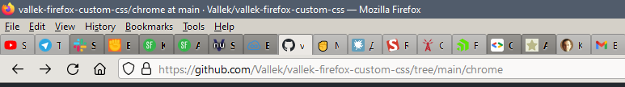

# My custom Firefox UI styles

This is a content of my Firefox "chrome" folder with custom css. It is mostly consists of parts of amazing [CustomCSSforFx](https://github.com/Aris-t2/CustomCSSforFx) project + couple small tweaks and css from other sources. 

The goal of this specific styles is to bring classic Firefox look. My main focus was tabs and url bar. But there are some other tweaks.

I wanted to share it because CustomCSSforFx could be a little overwhelming:) So if you like my Firefox look (check the screenshot) than you can just use mine.

## What's with dark tabs?

Dark tabs are unloaded tabs. It's very helpful to differentiate them if you have many tabs open. 

## How to apply styles

Just copy paste all files from chrome folder to your Firefox chrome folder in browser profile. To find profile location type about:support in address bar. Find Profile Folder > click on Open folder. There you'll find chrome folder.

userChrome.css - this is the main file for css styles. It imports (connects) other files.

**In order to have exact same look** you'll also need [XP Classic Theme](https://addons.mozilla.org/en-US/firefox/addon/xp-classic-theme/). And compact density enabled in Customize Toolbar. 

## Disclaimer

Changes I made in this code are far from optimized. Just sharing what I use personally. I do update it. But mostly when browser update breaks something.

**Updated for Firefox 100.** 

## userContent.css

I also threw here my version on userContent.css. Unlike userChrome.css this file changes pages content. But it can also change Firefox devtools. 

I have two tweaks there. Change Segoi UI font to Arial. I just hate it:) But you can change it to anything you have on your pc.

Second tweak is for devtools. It removes breadcrumbs which always disturbs me.

If you don't need any of that just ignore this file.